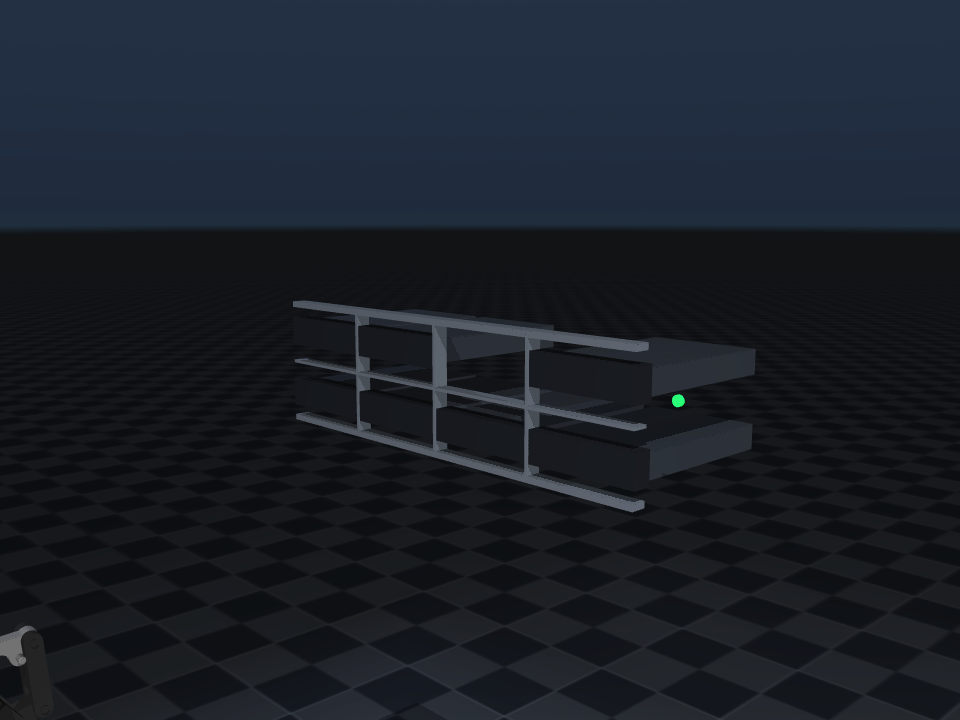

# hard_disk_robot

独立仓库的固定式 UR5e 服务器硬盘更换项目（远程：`git@github.com:JinHeMu/hard_disk_robot.git`）。当前阶段以 MuJoCo 代替真实硬件，目标是先冻结任务、数据、坐标系、安全和模块合同，再逐步实现自主运动学、轨迹规划、接触控制与局部残差学习。场景内使用的 UR5e + 2F-85 MJCF 与网格已 vendoring 到 `simulation/mujoco/models/ur5e/`，仓库自带全部资源、可从任意路径独立运行，不依赖工作区其他工程。

核心原则：

- 算法由本项目掌控；MuJoCo、ROS 2 和未来真机都是可替换适配器。
- ROS 2 将来负责通信、TF、驱动、记录、可视化与 watchdog，不承载研究算法。
- MoveIt 只作为验证工具、实验基线或 fallback，不是主链依赖。
- RL 将来只允许输出受限的局部位姿残差，不能直接输出关节力矩或拥有最终控制权。
- 当前不实现视觉、规划、完整换盘状态机、导纳控制或 RL，只建立可验证框架。

## 当前运行结果

- 固定 UR5e、Robotiq 2F-85、腕部六维 F/T、2U 服务器、8 个 2.5 英寸盘位和暂存台可加载。
- 机械臂、夹爪、目标托架、锁扣和 F/T 信号可通过命名接口访问。
- 提供独立限力门，超限时冻结新关节目标；这只是安全数据链检查，不等于闭环力控。
- 当前验证等级为 L2（MuJoCo headless 动力学与信号链）。

## 快速运行

以下命令在仓库根目录执行。MuJoCo 后端依赖可通过 `pip install -e '.[mujoco]'` 安装，也可以使用 `requirements.txt`；脚本会把 `src/` 加入 `sys.path`，未安装包也能直接运行。如果当前环境因为用户 site-packages 只读而导致 `pip install -e '.[mujoco]'` 失败，这不影响本项目运行：不需要安装本包，直接执行下面的命令即可。

推荐使用仓库提供的完全隔离 Conda 环境。它只使用 `conda-forge`，并在激活时
屏蔽宿主机 ROS、用户 site-packages 和 `~/.mujoco`：

```bash
conda env create -f environment.yml
conda activate hard_disk_robot
python3 scripts/check_isolated_environment.py
```

如果环境已经存在，使用下文记录的环境变量配置后，需要先执行一次
`conda deactivate && conda activate hard_disk_robot`，激活变量才会进入当前 shell。

```bash
python3 scripts/smoke_test.py
python3 -m unittest discover -s tests -v
python3 scripts/run_scene.py
```

完整场景展示示例位于 `examples/`：

```bash
# 打开交互式窗口，默认使用 overview_cam
python3 examples/scene_display_exp.py

# 从服务器前方相机观察，并显示 site 坐标轴
python3 examples/scene_display_exp.py --camera server_front_cam --show-sites

# 无显示器环境下验证同一场景入口
python3 examples/scene_display_exp.py --headless --seconds 1
```

UR5e 正/逆运动学的 MuJoCo 动画实验：

```bash
# 红色球为 Pinocchio FK 目标；机械臂依次移动到 IK seed 和 IK 解
python3 examples/ur5e_fk_ik_mujoco_exp.py

# 无界面运行并输出 IK、模型一致性和 MuJoCo 跟踪误差
python3 examples/ur5e_fk_ik_mujoco_exp.py --headless
```

该实验验证的是正/逆运动学，不是基于力矩的正/逆动力学。目标关节角仅用于
生成目标位姿，IK 求解只接收目标 `Pose` 和独立的 seed。

UR5e 的 Pinocchio 运动学是可选依赖：

```bash
pip install -e '.[kinematics]'
```

```python
import numpy as np

from hard_disk_robot.core import JointState
from hard_disk_robot.kinematics import UR5eKinematics

kin = UR5eKinematics()  # 默认读取仓库内 ur5e_from_mujoco.urdf
q = JointState(kin.joint_names, np.zeros(kin.dof))
pose = kin.forward(q)
J = kin.jacobian(q)     # 行顺序：[vx, vy, vz, wx, wy, wz]
q_again = kin.inverse(pose, q)
```

默认末端帧为 `wrist_3_link`；若需要夹爪安装座，可在构造时传入
`end_effector_frame="g_base"`。目标 `Pose.frame_id` 必须与构造参数
`base_frame` 一致，默认是 `world`。

无显示器环境生成固定相机截图：

```bash
MUJOCO_GL=egl python3 scripts/capture_scene.py
```




## 代码架构

```text
hard_disk_robot/
├── config/
│   └── task_sequence.yaml              # 12 阶段任务合同，不执行算法
├── simulation/mujoco/
│   ├── scene.xml                       # MuJoCo 场景装配与 home
│   ├── models/server_2u_8bay.xml       # 服务器、硬盘、机架和机构
│   ├── models/ur5e/                    # vendored UR5e+2F-85 MJCF 与网格
│   └── captures/                       # 视觉回归截图
├── src/hard_disk_robot/
│   ├── core/                           # 数据结构与后端无关端口
│   ├── adapters/
│   │   ├── mujoco/                     # 当前可运行后端
│   │   └── ros2/                       # 将来通信/硬件适配层
│   ├── kinematics/                     # 自主 FK/Jacobian/IK
│   ├── planning/                       # 插值、优化、碰撞代价
│   ├── contact/                        # 力处理、接触检测、导纳
│   ├── perception/                     # 机架定位和盘位估计
│   ├── safety/                         # 确定性限力/限速/工作区保护
│   ├── task/                           # primitive 与状态机
│   └── baselines/moveit/               # 可选基线/验证/fallback
├── scripts/                            # 人工运行入口
├── examples/                           # 可直接运行的场景与算法示例
├── tests/                              # 合同与动力学回归
└── docs/                               # 中文规格、架构和开发路线
```

依赖方向必须保持：

```text
task / planning / contact / safety
                 ↓
             core ports
                 ↑
       adapters/mujoco 或 adapters/ros2
```

核心算法不得直接 import `mujoco`、`rclpy` 或 MoveIt。

## 稳定接口

- `core.types`：`Pose`、`Wrench`、`JointState`、`TrajectoryPoint`。
- `core.ports`：机械臂、夹爪、F/T、机构、运动学、规划和接触控制端口。
- `UR5eKinematics`：基于 Pinocchio 的固定基座 FK、6D Jacobian 与阻尼最小二乘 IK。
- `MujocoRobotAdapter`：按关节名称接收弧度目标；夹爪上层合同使用米制开口宽度。
- `MujocoWristFTAdapter`：原始、去皮六维 wrench。
- `MujocoMechanismAdapter`：托架抽出和锁扣按压接口。
- `ForceLimitGuard`：独立于学习策略的确定性安全门。

## 文档入口

- [功能规格与验收标准](docs/01_功能规格与验收标准.md)
- [模型参数与假设](docs/02_模型参数与假设.md)
- [架构、依赖与稳定接口](docs/03_架构与接口.md)
- [开发与维护标准](docs/04_开发与维护标准.md)
- [从 MuJoCo 到自主算法和 ROS 2 的路线](docs/05_算法开发路线.md)
