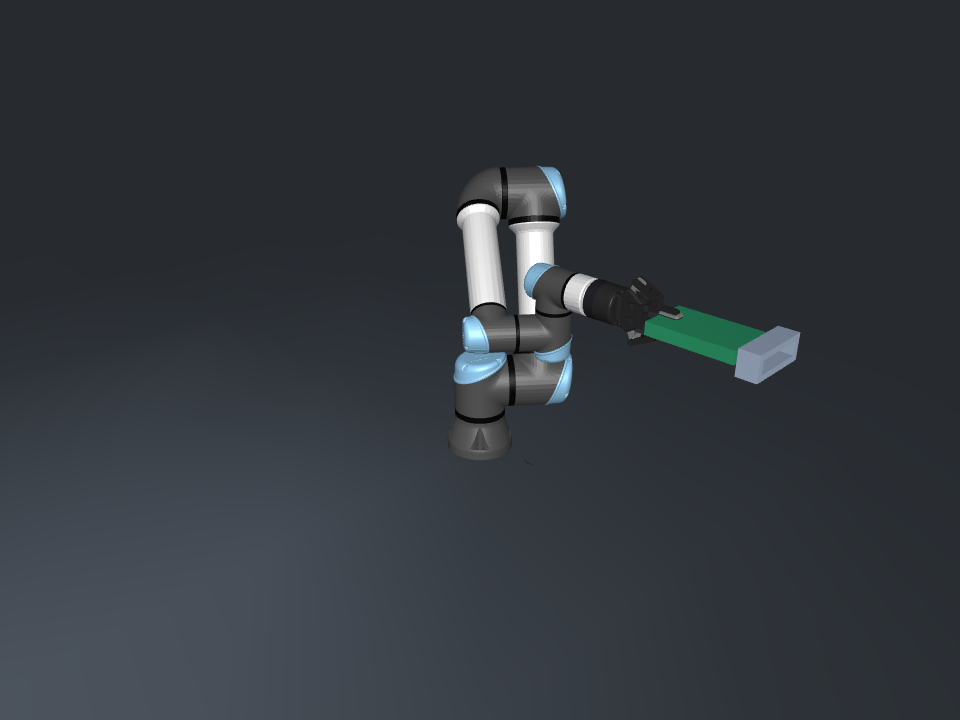
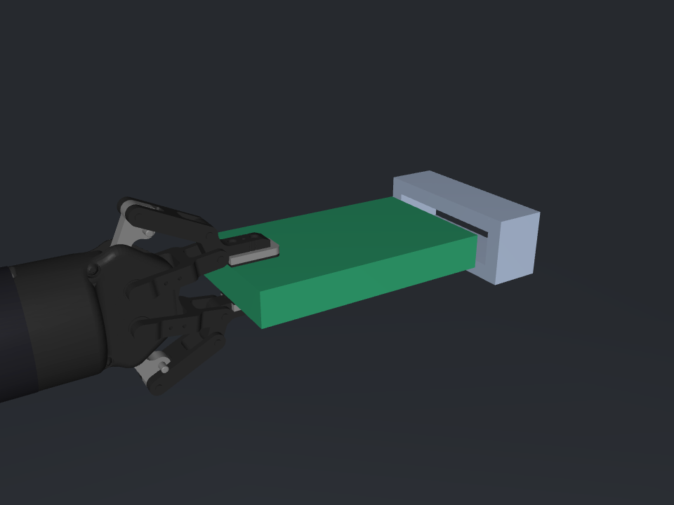

# 硬盘精密插入实验

固定 UR5e + Robotiq 2F-85 + 腕部六维力传感器的 MuJoCo 实验场景。启动时机械臂已经夹好硬盘，用于后续开发力控插入。旧服务器、托架、锁扣、暂存台和完整换盘示例已移除。

硬盘为 **177 × 106 × 26 mm** 长方体；沿 177 mm 长度方向水平插入 **106.5 × 26.5 mm** 的矩形通道，居中时每侧间隙 **0.25 mm**。通道深 40 mm，无倒角、无后挡板。夹爪从后端 106 mm 短边的中间伸入，沿 26 mm 厚度夹紧，采用理想刚性夹持。

初始硬盘前端距入口 10 mm；未来目标插深为 50 mm，夹爪保持在口外。本次实现的是场景和接触测力验证，**没有实现闭环力控插入、抓取打滑或真实硬件控制**。

## 运行

```bash
conda activate hard_disk_robot
python examples/check_isolated_environment.py
python examples/scene_display_exp.py
# 入口近景，或无界面保持初始状态 5 秒
python examples/scene_display_exp.py --camera insertion_cam --show-sites
python examples/scene_display_exp.py --headless --seconds 5
```

首次安装环境：`conda env create -f environment.yml`。环境提供 MuJoCo、NumPy、Pinocchio 和 Pillow；激活时隔离宿主 ROS 路径。所有示例从自身路径寻找模型，可在任意工作目录运行。

```bash
python examples/smoke_test.py
python -m pytest -q
# 有界位置运动制造接触，验证腕部测力；不是力控插入
python examples/validate_insertion_contact.py --output simulation/mujoco/reports/contact_validation.json
MUJOCO_GL=egl python examples/capture_scene.py
```





## 接口与算法所有权

- `load_model()` / `reset_home()`：加载场景、恢复已夹持初始状态；`home` 的控制量含静态重力平衡偏置。展示入口保持这些控制量，不重新发送未经补偿的关节位置。
- `MujocoRobotAdapter`：保留命名关节位置和夹爪控制接口。此场景以 `grasp_lock_*` 等式约束固定指关节；夹爪开口命令仍可写入，但不会释放理想抓持硬盘。
- `MujocoWristFTAdapter`：原始与去皮六维数据，坐标系 `wrist_ft_site`；静态去皮不等于任意姿态重力补偿。
- `MujocoCollisionChecker`：把夹持硬盘计入机器人，硬盘与插口接触不会被忽略。
- 通用运动学、规划、核心合同和限力门保留。算法层不依赖 MuJoCo；`insertion_validation` 中的局部姿态求解和位置运动仅供仿真验收，不是生产控制器。

## 文档

- [功能与验收](docs/01_功能规格与验收标准.md)
- [模型参数与假设](docs/02_模型参数与假设.md)
- [架构与接口](docs/03_架构与接口.md)
- [维护标准](docs/04_开发与维护标准.md)
- [后续算法路线](docs/05_算法开发路线.md)
- [本次验收结果](docs/06_场景重建验收报告.md)
