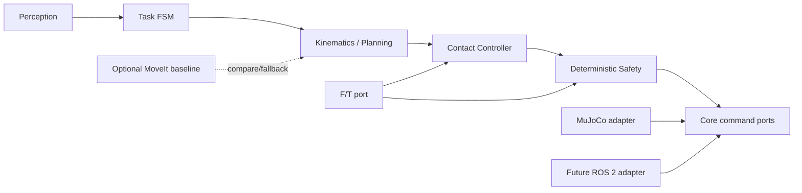

# 架构与接口

## 1. 架构决策

本项目采用六边形/端口—适配器结构。算法只面向 `core.ports`，不直接面向 MuJoCo、ROS 2 或 MoveIt。

关键约束：

- `core` 不得 import `mujoco`、`rclpy`、MoveIt 或厂商 SDK。
- `kinematics/planning/contact/task` 是自主算法层，不能隐藏在适配器或 demo 中。
- `adapters/mujoco` 与未来 `adapters/ros2` 实现同一语义。
- `safety` 拥有最终命令过滤权；RL、MoveIt 和规划器都不能绕过它。
- MoveIt 只能用于结果验证、实验对照和显式 fallback。

## 2. 模块职责

| 模块 | 拥有内容 | 当前状态 |
|---|---|---|
| `core` | 数据类型、单位、坐标系字段、端口 Protocol | 已实现 |
| `adapters/mujoco` | 模型加载、关节/夹爪、F/T、硬盘机构 | 已实现并测试 |
| `adapters/ros2` | TF、JointState、驱动、传感器和 watchdog 映射 | 仅边界，不实现 |
| `kinematics` | FK、Jacobian、自主 IK | 预留 |
| `planning` | 插值、轨迹优化、碰撞代价、可操作度代价 | 预留 |
| `contact` | 力滤波、补偿、接触检测、导纳/力位控制 | 预留 |
| `perception` | 机架位姿、盘位模板、手眼标定接口 | 预留 |
| `task` | primitive、FSM、失败恢复和动作所有权 | 已定义枚举，未执行 |
| `safety` | 限力、限矩；未来限速和工作区保护 | 已实现限力门 |
| `baselines/moveit` | 对照、可视化验证和 fallback | 预留且非依赖 |

## 3. 核心数据合同

- `Pose(frame_id, position_m, quaternion_wxyz)`：四元数顺序固定为 `wxyz`。
- `Wrench(frame_id, force_n, torque_nm)`：力和力矩必须属于同一个显式坐标系。
- `JointState(names, position_rad)`：关节顺序随名称保存，不能依赖裸下标猜测。
- `TrajectoryPoint(time_from_start_s, position_rad)`：时间非负、位置有限。

`core.types` 会拒绝空坐标系、错误维度、NaN/Inf 和零四元数。

## 4. 坐标系

- `world`：MuJoCo 世界坐标，`+Z` 向上。
- `server_chassis`：服务器机箱中心，深度沿世界 `X`。
- 插入方向：从服务器前面板朝机箱内部，为世界 `+X`。
- 抽出方向：朝机器人，为世界 `-X`；`target_drive_slide` 正值表示抽出。
- `wrist_ft_site`：F/T 输出局部系；局部 `+Z` 从法兰指向夹爪。
- 位移使用米、角度使用弧度、力使用牛顿、力矩使用牛顿米。

## 5. MuJoCo 稳定名称

| 类型 | 名称 | 数据 |
|---|---|---|
| 机械臂执行器 | `shoulder_pan` … `wrist_3` | 6×关节位置目标 rad |
| 夹爪执行器 | `fingers_actuator` | `0` 张开，`255` 闭合 |
| 力传感器 | `wrist_force` | `[Fx,Fy,Fz]`，局部系，N |
| 力矩传感器 | `wrist_torque` | `[Tx,Ty,Tz]`，局部系，N·m |
| 托架关节 | `target_drive_slide` | `[0,0.16]`，正值抽出，m |
| 锁扣关节 | `target_latch_press` | `[0,0.006]`，正值按下，m |
| 新盘自由关节 | `replacement_drive_free` | 7 维 free joint |
| TCP site | `pinch` | 当前夹爪几何参考点 |

## 6. 当前适配器接口

- `MujocoRobotAdapter.read_joint_state()` / `command_joint_positions(target)`：通过关节名称交换弧度状态和目标，不依赖数组的隐含顺序。
- `MujocoRobotAdapter.command_gripper_opening(opening_m)`：上层统一使用 `[0,0.085] m` 的物理开口；适配器内部再换算成 MuJoCo 模型的 `[255,0]` 原始控制量。
- `MujocoRobotAdapter.command_arm(...)` / `command_gripper(...)`：仅供 MuJoCo 调试的低层接口，不属于跨后端核心合同。
- `MujocoWristFTAdapter.read_wrench()`：返回带 `wrist_ft_site` 坐标系的 `Wrench`。
- `MujocoWristFTAdapter.raw()` / `tare()` / `wrench()`：仅供后端调试与去皮；记录并扣除当前姿态偏置。
- `MujocoMechanismAdapter.command(extraction, latch)`：限制到机构范围。
- `ForceLimitGuard.filter_arm_target(...)`：超限时保持当前关节目标。
- `load_model()` / `reset_home(...)`：以仓库内绝对路径加载 `scene.xml`，可从任意工作目录调用；不要在仓库根目录直接把相对路径 `simulation/mujoco/scene.xml` 传给 `MjModel.from_xml_path()`，因为当前 MuJoCo 版本对嵌套 include 的网格解析依赖顶层路径形式。

阈值门不能替代速度限制、碰撞检测、软件急停、硬件安全控制器或接触控制器。
