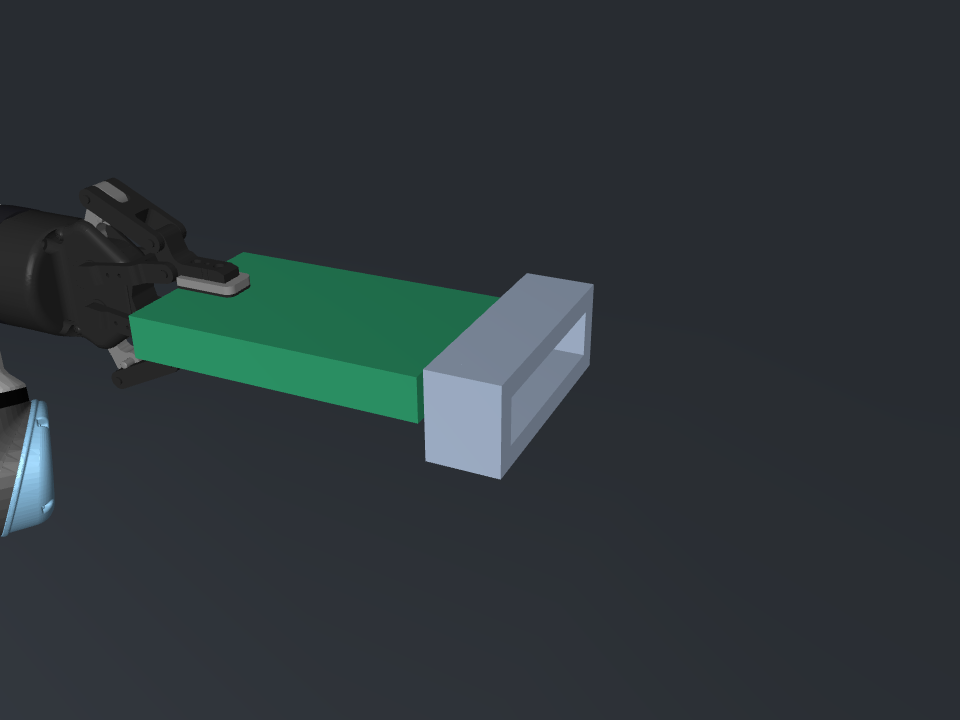

# 场景重建验收报告

日期：2026-09-09。环境：隔离 Conda `hard_disk_robot`，Python 3.12.14、MuJoCo 3.12.0、NumPy 2.5.2、Pinocchio 4.1.0。

## 结果

**场景与传感器链验证通过。** 旧服务器模型、托架/锁扣适配器和服务器换盘示例已删除。新场景为单个精密矩形通道、单块后端短边居中刚性夹持硬盘及 UR5e。

- pytest：31 项通过，包含后端短边居中夹持方向与参考点检查。
- 硬盘 177×106×26 mm，净口 106.5×26.5 mm，40 mm 深；单侧间隙 0.25 mm。
- 初始前端距离 10 mm，5 秒保持无接触；重置、固定夹持相对位姿、质量及惯量检查通过。
- 从入口外 10 mm 到入口内 50 mm，121 个几何采样姿态全部无碰撞。此项不表示动态插入或闭环插入成功。
- 向硬盘施加已知 2 N 外载荷，腕部去皮后测得约 2.0052 N；限力门检查通过。
- 轴向入口阻挡、侧壁接触、传感器世界系六维载荷与接触反力及力矩核对全部通过。

## 接触数值结果

| 工况 | 时间步 ms | 峰值力 N | 最大穿透 mm | 稳态主方向响应 N |
|---|---:|---:|---:|---:|
| 入口轴向阻挡 | 1.0 | 3.481 | 0.000310 | X：2.033 |
| 入口轴向阻挡 | 0.5 | 2.919 | 0.000185 | X：2.034 |
| 通道侧壁接触 | 1.0 | 0.469 | 0.001087 | Y：0.357 |
| 通道侧壁接触 | 0.5 | 0.429 | 0.000525 | Y：0.357 |

峰值穿透均低于 0.05 mm 验收界限，未放大净口、未关闭盘与通道碰撞。时间步减半后的最后 0.1 秒六维均值比较通过；瞬态峰值不是完全一致，不能把稳态一致理解为所有瞬态收敛。

完整数据见 [接触验证 JSON](../simulation/mujoco/reports/contact_validation.json)。报告给出原始与去皮六维载荷、坐标系、实际插深与偏差、接触对象以及接触反力核对。

## 视觉检查

以下是保持初始状态后实际 MuJoCo 渲染，已人工检查。绿色盒体是硬盘，灰色四壁体是插口。无服务器或暂存场景残留；指垫从后端短边中间夹住上下表面，夹爪朝向与插入方向一致。为满足该姿态的可达性，盘中心与入口整体沿世界 X 平移了 100 mm；前端间距仍为 10 mm。

## 交付边界

没有实现闭环力控插入、摩擦抓持、打滑或实机验证。保留的 FK/IK 示例仅用于通用运动学演示，其毫米级位置跟踪检查，不满足本实验的精密插入要求，不能直接作为插入控制器。
