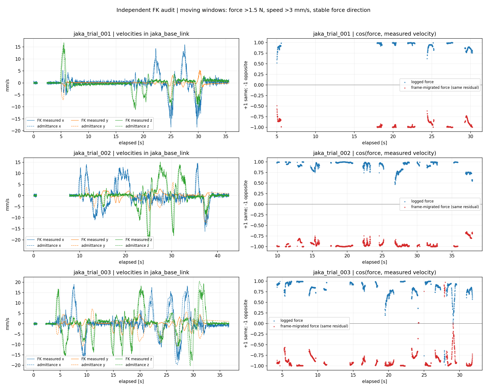
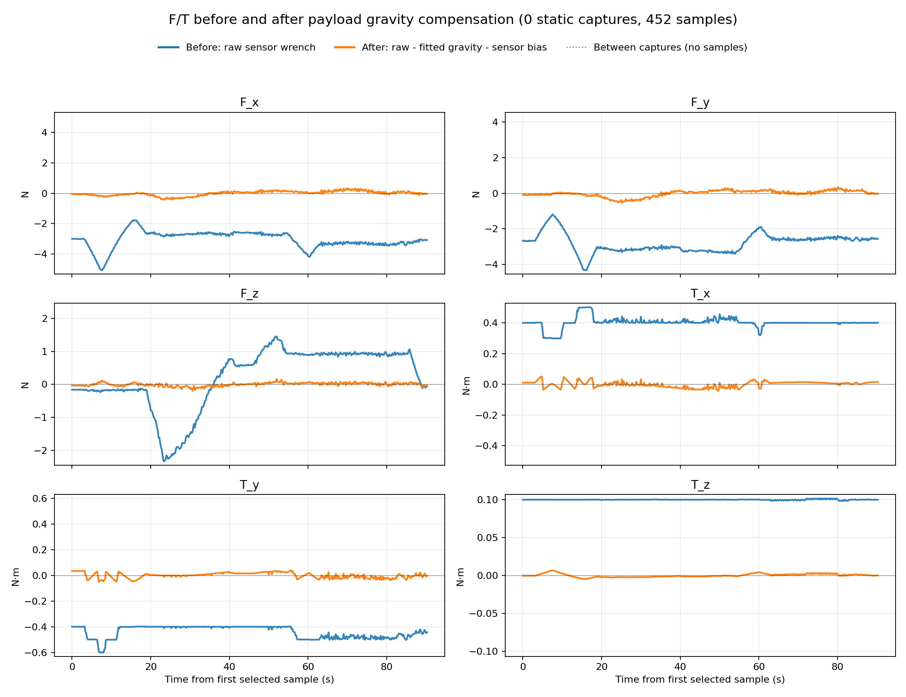

# JAKA 三份实机日志力方向排查

## 结论

主要证据指向：tool0 绕自身 Z 轴旋转 180° 后，重力标定 JSON 仍保存旧 tool 坐标定义下的传感器旋转与力臂；在线加载该 JSON 又覆盖了当前代码已修正的默认变换。三个日志都使用同一份旧变换，因此第三次运行即使更新代码，仍未修复这条重力补偿路径。

独立关节 FK 重算表明，机械臂基本顺着日志内部的力和导纳速度运动。按新 tool0 定义重表达旧外参后，原先记录的运动却基本与该候选力方向相反。没有证据支持在导纳、IK 或关节发送环节出现统一的额外负号。

这证明软件坐标定义存在可重现的不一致；手的实际施力方向没有独立记录，尚不能把所有三维方向或传感器整体符号认定为已实机验证。

## 1. 数据与方法

逐条读取三个日志中的 measured_q_rad，用日志 metadata.json 保存的 URDF 快照独立累乘固定关节原点与转动关节变换，重新得到 jaka_base_link 中的 TCP 位置、旋转与几何雅可比。未直接使用日志中已有的 TCP 位置来判定运动方向。

再用系统 NumPy 1.x / Pinocchio 环境，每份日志抽查 30 个姿态，对独立 FK 和雅可比交叉验证。当前 URDF 与三份日志保存的 URDF 相同。全部关节重算位置与日志 FK 的最大分量差小于 8e-16 m，Pinocchio 抽查雅可比差小于 1.3e-15。此一致性验证的是模型/软件计算，不是独立的物理 TCP 标定。

实际速度由关节 FK 位置在未来 5 个采样间隔（约 40 ms）的差分得到，避免单周期关节量化噪声。剔除故障、未更新导纳及未发送命令的窗口；施力比较要求力 >1.5 N、实际速度 >3 mm/s，窗口内施力方向夹角余弦 >0.95、各采样力均 >1.5 N。所有向量比较均在基座坐标系中。所有日志的按键均为空，没有键盘运动混入。

## 2. 运动方向结果

|日志|稳定施力运动窗口|实际运动与日志力同向比例|实际运动与新坐标定义候选力同向比例|实际运动与导纳速度同向比例|
|---|---:|---:|---:|---:|
|jaka_trial_001|627|100.00%|0.00%|100.00%|
|jaka_trial_002|1570|100.00%|0.00%|100.00%|
|jaka_trial_003|1445|98.69%|1.73%|98.19%|

“同向”指点积 >0，并非每个轴都相同。候选力仅把同一份记录残余力按新定义重表达，未重新模拟改变后的真实接触过程。样本阈值与分母不同，导纳速度列不能直接与前两列计数比较。详细数值在 summary.json，逐周期量在各日志对应的 *_samples.csv。

三个日志稳定窗口中，工具 Z 主导的窗口分别只有 0、3、18 个；主要激励在工具 X/Y。因此用户感觉“往哪推都反”，在这三份日志里主要体现为 X/Y 变换问题，仍需单独只读核查 Z 方向。回正、惯性、姿态耦合也能造成短时力与速度不一致。



## 3. 为什么 tool0 改动会影响方向

提交 9f05e08 将 URDF tool0_joint 的 rpy 从 [0,0,0] 改为 [0,0,pi]，原点位置不变。质量变化不影响此固定基座运动学计算。对同一个关节值，有 R_B_Tnew = R_B_Told D，其中 D=diag(-1,-1,1)。

若物理传感器没有移动，则必须同时改为 R_Tnew_S = D R_Told_S，以及 r_Tnew_S = D r_Told_S。这样 R_B_Tnew R_Tnew_S 才仍等于原来的物理传感器朝向。单改 tool0 会使工具 X/Y 分量翻转，工具 Z 分量保持。

三个日志记录的 R_T_S 都还是旧矩阵；tool_to_sensor_m 都为 [0,-0.05,-0.4] m。对应新坐标定义应为 [0,+0.05,-0.4] m。在线 wrench.py 加载 JSON 的 sensor_to_tool_rotation 和 tool_to_sensor_m 后覆盖默认值。仅修改 default_tool0_ft_transforms() 不会改变包含这两字段的旧标定。

独立回放同时验证：传感器旋转阶段残差小于 8e-15 N，积分偏移到基座的应用残差小于 8e-17 m，导纳离散积分残差接近浮点精度。没有发现这一链路额外取反。

## 4. 重力辨识修改与重新拟合

使用者进一步确认底盘相对地面约 2°、机械臂相对底盘约 1.5° 的误差，累计倾斜可能达到约 3–4°；末端没有严格调平。末端水平仪读数不能直接当成基座倾角；按安装误差的合计上限，将默认约束设为 4°，同时提供 2° 的敏感性结果。

现在 identify_ft_payload.py 默认在基座竖直方向的 4° 锥内重新优化带符号重力向量和零偏。不是先自由拟合，再只截断角度。--gravity-tilt-limit-deg 0 可固定竖直；--gravity-mode free 保留自由拟合。约束后的倾角是模型假设，并非水平仪测量结果。诊断仍保留 unconstrained_gravity_tilt_deg 和自由拟合残差，防止约束掩盖错误。

新增 --repair-stale-tool0-extrinsics 用于“tool0 已改为 Z-180、采集器仍使用旧外参”这一特定历史数据。它同时重建每个采样的物理传感器朝向并修正输出外参，然后重新拟合 h、质心和零偏。不会只改两个外参而留下旧 h/偏置。正常的新采集数据不应使用这一修复选项。

|模型|倾角|拟合质量 kg|力 RMS（分量）N|力矩 RMS（分量）N·m|
|---|---:|---:|---:|---:|
|旧外参，自由拟合|52.38°|0.2551|0.6593|0.02529|
|修正外参，自由拟合|13.80°|0.6797|0.1038|0.01655|
|修正外参，2°约束|2.00°|0.6705|0.1559|0.01602|
|修正外参，4°约束|4.00°|0.6720|0.1406|0.01598|

现有标定 CSV 的 452 行中有 263 行带运动按键，且没有有效静态窗口。因此这些候选参数是现有数据上的离线重新拟合，尚未经过独立静态姿态验证。修正外参后自由倾角仍为 13.8°，约束后的结果触及 2°/4° 上界；安装外参、数据是否真正无外力、传感器原始模式及 FK/TCP 对齐仍需核查。质量 0.67 kg 也应与实际传感器下方负载质量对照。

修正后的 signed_gravity_force_base_n 的 Z 分量仍为负，没有从这一离线标定结果得到必须整体乘 -1 的证据。手施力方向仍需独立只读测量确认；不要为了纠正 X/Y 翻转直接将六轴全部取反。力臂变化同时影响力矩，但用户尚未测试力矩，不能认定六轴方向都已正确。



## 5. 新输出与下一步

推荐先只读核查候选标定 candidate_tool0_repaired_bounded4.json，candidate_tool0_repaired_bounded2.json 为 2° 敏感性比较。当前实机 YAML 仍指向原标定。下一步先以候选标定进行 dry-run 的独立方向验证：未接触时确认残余力，再在传感器加载侧的工具上分别施加已知方向的力，查看基座方向下的外力与预测柔顺位移是否一致；尤其补测工具 ±Z。只读验证不发送运动命令。

```bash
python3 src/replace_disk_robot/applications/jaka_keyboard/jaka_keyboard_node.py --dry-run --gravity-json logs/force_direction_audit/candidate_tool0_repaired_bounded4.json --log-dir logs/jaka_direction_dryrun
```

该日志目录需尚不存在，命令由用户在实机环境手动执行。若获得基座的独立倾角测量，可再以实测边界辨识；不要把末端姿态读数直接代入。

这些结论来自既有实机日志的离线审阅及模型交叉验证。本次没有启动机械臂、没有验证新参数的闭环运动效果。

验证：重力辨识、采集器、日志、导纳与分析相关测试共 61 项通过；语法与差异格式检查通过。
